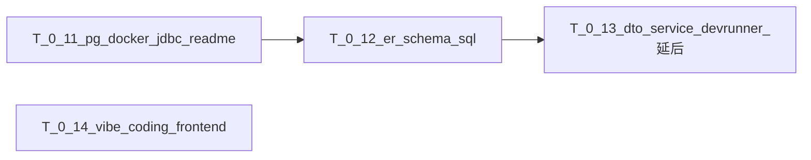

# Sprint 0 Backlog（后端数据库主线）

本冲刺只保留后端数据库落地任务，目标是让团队在冲刺结束时具备可复现的本地数据库环境、可执行的 ER 对应 schema，以及可被 DevRunner 验证的 DTO/Service 基线。  
规划来源见 [SprintReleasePlan.md — 冲刺 0](../project_backlog/SprintReleasePlan.md)；ER 基准见 [JavaBackendArchitecture.md](../project_backlog/JavaBackendArchitecture.md)。

---

## 1. 进度图例

| 符号  | 含义  | 参与同学（含出勤/工时记录） |
| --- | --- | -------------- |
| ✅   | 已完成 | —              |
| 🔄  | 进行中 | —              |
| ⬜   | 未开始 | —              |
| ⏭️  | 跳过/延后 | —              |

---

## 2. 冲刺目标（仅 Sprint 0）

1. 建立 PostgreSQL 本地运行环境（Docker）并接入 JDBC，README 可复现。
2. 按现有 ER 输出 PostgreSQL schema SQL，并能一次性建库成功。
3. 为 ER 对应实体补齐 DTO 和 Service，并用 DevRunner 验证启动执行正确。

---

## 3. 任务清单（T-0.xx）

| 任务 ID    | 任务描述                                                                                                                       | 分配角色       | 预计小时      | 前置依赖     | 进度  | 参与同学（含出勤/工时记录） |
| -------- | -------------------------------------------------------------------------------------------------------------------------- | ---------- | --------- | -------- | --- | -------------- |
| `T-0.11` | PostgreSQL 搭建：调研并落地 Docker（建议 docker compose）；接入 JDBC（Spring Data JDBC + PostgreSQL Driver + Flyway）；在 README 写清启动、连接、验证步骤 | 后端开发 × 1   | 4         | 无        | ✅   | @Lei Feng      |
| `T-0.12` | 基于现有 ER 编写 PostgreSQL schema SQL（含 `DROP TABLE IF EXISTS` + `CREATE TABLE`）；本地执行后完成全库创建                                    | 后端开发 × 1   | 4         | `T-0.11` | ✅   | @Yuyang Zhou, @Lei Feng   |
| `T-0.13` | 按 ER 条目定义 DTO；为每个数据库实体建立 Service；新增/完善 DevRunner，对 DTO+Service+数据库连通进行启动验证                                                 | 后端开发 × 1~2 | 6         | `T-0.12` | ⏭️  | —              |
| `T-0.14` | 使用vibe coding搭建前端框架，完成UI方面的设计和实现落地，并进行调试并确认完成。                                                                             | 前端开发 × 1   | 4         | 无        | ✅   | @Hao Chen      |
|          |                                                                                                                            | **冲刺总计**   | **12 小时** |          | —   | —              |

---

## 4. 执行顺序与依赖

---

## 5. 验收标准（Definition of Done）

### `T-0.11`

- 本地可通过 Docker 启动 PostgreSQL，至少一名成员按 README 独立完成。
- 应用在 `dev` 配置下能通过 JDBC 连通数据库。
- README 至少包含：启动命令、连接参数位置、连通性验证命令（如 `SELECT 1`）。

### `T-0.12`

- 存在版本化 SQL schema 文件，覆盖当前 ER 的核心表。
- SQL 可在空库一次执行成功；重复执行不会因旧表残留导致失败（通过 `DROP TABLE IF EXISTS` 处理）。
- 建库结果与 ER 关键字段一致（主键、外键、唯一约束至少完成第一版）。

### `T-0.13`

- 每个数据库实体具备对应 DTO 与 Service（命名统一、职责清晰）。
- DevRunner 可在 `dev` 环境启动并完成最小验证流程（读/写或初始化检查）。
- 启动日志可证明 Service 被正确执行，且无启动级报错。

### `T-0.14`

- 使用 vibe coding 完成前端框架搭建（项目可正常运行/构建），并完成至少一套核心 UI 页面与路由落地。
- 完成指定 UI 设计的实现（与当前 Sprint 0 范围内的页面结构一致），并能在本地通过开发服务器访问到对应页面内容。
- 进行必要调试，确认页面无关键控制台报错、关键交互不阻塞（页面可加载、表单/按钮可响应到预期）。
- 在 README 或变更说明中记录启动与调试的关键步骤（至少包含如何启动前端与查看常见错误输出位置）。

---

## 6. 验收证据模板（PR 描述建议）

- `T-0.11`：贴 PostgreSQL 启动命令、应用启动日志关键片段、README 新增章节截图/说明。
- `T-0.12`：贴 schema SQL 文件路径、建库执行结果（成功输出或表清单）。
- `T-0.13`：贴 DTO/Service/DevRunner 文件路径与启动验证日志。

---

## 7. 移出 Sprint 0 的任务

以下任务不再计入本冲刺，统一后移到后续冲刺安排：

- UI/UX 线框与设计系统
- QA 策略与模板
- OpenAPI 契约冻结
- 认证 API（Security/JWT/注册/登录）
- 项目板与流程管理类任务

---

## 8. 相关文档

| 文档                                                                          | 用途       | 参与同学（含出勤/工时记录）                         |
| --------------------------------------------------------------------------- | -------- | -------------------------------------- |
| [SprintReleasePlan.md](../project_backlog/SprintReleasePlan.md)             | 全量冲刺主计划  | @Hao Chen                              |
| [JavaBackendArchitecture.md](../project_backlog/JavaBackendArchitecture.md) | ER 与后端分层 | @Qiyuan Huang,@Hao Chen                |
| [ProductBacklog.md](../project_backlog/ProductBacklog.md)                   | 用户故事与优先级 | @Hao Chen, @Qiyuan Huang, @Yuyang Zhou |

