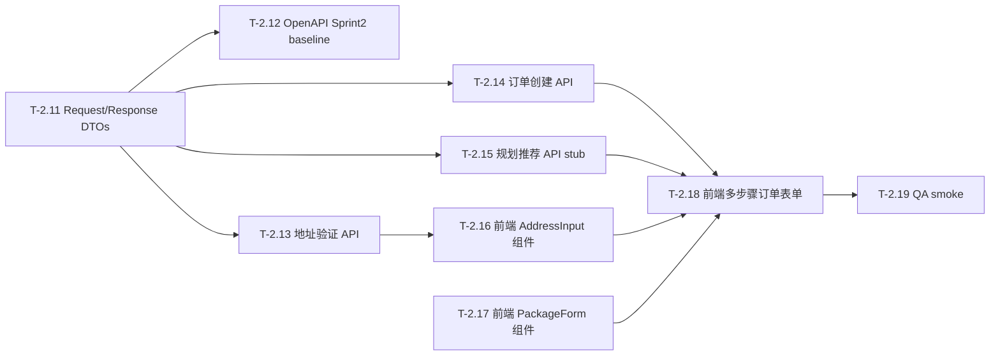

# Sprint 2 Backlog（地址 & 包裹输入）

本冲刺聚焦地址输入与包裹规格的核心流程：用 Google Maps 做地址自动补全与服务区验证，补齐包裹规格选择，完成订单草稿创建链路，并提供规划/推荐 API 的最小可用实现；在前端侧将多步骤订单表单与后端接口联调闭环。

规划来源见 [SprintReleasePlan.md](../project_backlog/SprintReleasePlan.md)；ER 基准见 [JavaBackendArchitecture.md](../project_backlog/JavaBackendArchitecture.md)。

> **已有基础（Sprint 0 交付，无需重建）：** `OrderEntity`、`OrderParcelEntity`、`PaymentEntity` 及其对应的 DTO、Repository、Service 均已完成。Sprint 2 后端工作量主要集中在 Controller 层、Request/Response DTOs 与业务逻辑（地址验证、规划 stub）；各方向互相独立，可并行推进。

---

## 1. 进度图例

| 符号 | 含义      | 参与同学（含出勤/工时记录） |
| ---- | --------- | --------------------------- |
| ✅   | 已完成    | —                           |
| 🔄   | 进行中    | —                           |
| ⬜   | 未开始    | —                           |
| ⏭️   | 跳过/延后 | —                           |

---

## 2. 冲刺目标（Sprint 2）

1. 补齐订单相关 Request/Response DTOs 并冻结 Sprint 2 OpenAPI baseline。
2. 实现地址验证 API（SF 服务区边界校验），为后续路线规划提供地理校验入口。
3. 实现订单创建 API：用户可创建草稿订单、添加包裹、查询订单历史（GET /orders/me）。
4. 实现规划/推荐 API（最小可用 stub）：输入地址 + 包裹规格，返回推荐车型/中心/ETA/价格。
5. 前端：Google Maps 地址自动补全组件 + 包裹选择表单 + 多步骤订单表单端到端联调。

---

## 3. 任务清单（T-2.xx）

| 任务 ID  | 任务描述                                                                                                                                          | 分配角色              | 预计小时   | 前置依赖        | 进度 | 参与同学（含出勤/工时记录）       |
| -------- | ------------------------------------------------------------------------------------------------------------------------------------------------- | --------------------- | ---------- | --------------- | ---- | --------------------------------- |
| `T-2.11` | 新增 Sprint 2 所需 Request/Response DTOs：`CreateOrderRequest`、`CreateParcelRequest`、`PlanRequest`/`PlanResponse`、`AddressValidateRequest`/`AddressValidateResponse` | 后端 Lead × 1         | 3          | —               | ⬜   | @Qiyuan Huang, @Hangyi Gan, @Yanjia Kan |
| `T-2.12` | 冻结 Sprint 2 OpenAPI baseline：在 `sprint2-baseline.yaml` 中补齐 `/orders`、`/orders/{id}/parcels`、`/validate/address`、`/plan` 端点契约           | 后端 Lead × 1         | 3          | `T-2.11`        | ⬜   | @Qiyuan Huang                    |
| `T-2.13` | 地址验证 API：实现 `AddressValidationService`（SF 服务区多边形边界校验）并暴露 `POST /api/v1/validate/address` 端点                               | 后端开发 × 1          | 4          | `T-2.11`        | ⬜   | @Yanjia Kan                      |
| `T-2.14` | 订单创建 API：实现 `OrderController`（`POST /orders`、`POST /orders/{id}/parcels`、`GET /orders/{id}`、`GET /orders/me`）                         | 后端 Lead + 后端 × 1  | 5          | `T-2.11`        | ⬜   | @Qiyuan Huang, @Lei Feng         |
| `T-2.15` | 规划/推荐 API（stub）：实现 `PlanController`（`POST /api/v1/plan`）— 查询最近中心、匹配可用车型、返回 ETA 与价格 stub                             | 后端开发 × 1          | 4          | `T-2.11`        | ⬜   | @Hangyi Gan                      |
| `T-2.16` | 前端：Google Maps 地址自动补全组件（`AddressInput`）及服务区有效性指示器                                                                         | 前端开发 × 1          | 4          | —（可先用 mock）| ⬜   | @Yiyuan Miao                     |
| `T-2.17` | 前端：包裹选择表单（`PackageForm`）：尺寸 S/M/L 卡片、重量输入、易碎标记 toggle                                                                  | 前端开发 × 1          | 3          | —               | ⬜   | @Jiayi Gao                       |
| `T-2.18` | 前端：多步骤订单表单串联（地址 → 包裹 → 规划方案 → 提交确认），接通真实后端 API                                                                  | 前端 Lead × 1         | 5          | `T-2.14`、`T-2.15`、`T-2.16`、`T-2.17` | ⬜   | @Yuyang Zhou  |
| `T-2.19` | QA 烟雾测试：地址验证边界 + 订单创建端到端 + 关键失败路径（越界地址、重量为零、未认证创建订单）                                                  | QA/测试 × 1           | 2          | `T-2.18`        | ⬜   | @Sida Xue                        |
|          |                                                                                                                                                   | **冲刺总计**          | **33 小时**| —               | —    | —                                |

---

## 3.1 可直接下发的子任务拆分

> 每个子任务只设 1 个主负责人，最多 1 个配合人；保证 PR 小而独立，方便逐步合入 `develop`。

| 子任务 ID | 对应主任务 | 可直接发下去的内容                                                                                           | 建议主负责人  | 建议配合人    | 交付物 / 完成标志                                                    |
| --------- | ---------- | ------------------------------------------------------------------------------------------------------------ | ------------- | ------------- | -------------------------------------------------------------------- |
| `T-2.11a` | `T-2.11`   | 新建 `CreateOrderRequest`（userId、pickupAddress、dropoffAddress、vehicleTypeChosen?）与 `CreateParcelRequest`（sizeTier、weightKg、fragile、deliveryNotes）| @Qiyuan Huang | @Lei Feng     | record 类可编译，字段有 `@JsonProperty` snake_case 注解              |
| `T-2.11b` | `T-2.11`   | 新建 `PlanRequest`（pickupAddress、dropoffAddress、sizeTier、weightKg）与 `PlanResponse`（options 列表：vehicleType、centerId、etaMinutes、estimatedPrice） | @Hangyi Gan   | @Qiyuan Huang | record 类可编译，PlanResponse 包含 options 数组字段                  |
| `T-2.11c` | `T-2.11`   | 新建 `AddressValidateRequest`（rawAddress 或 lat/lng）与 `AddressValidateResponse`（valid、normalizedAddress、message） | @Yanjia Kan   | @Qiyuan Huang | record 类可编译，字段覆盖验证结果与标准化地址                        |
| `T-2.12a` | `T-2.12`   | 在 `sprint2-baseline.yaml` 中补齐所有 Sprint 2 端点定义（路径、请求体、响应体、错误体）并冻结                | @Qiyuan Huang | @Yuyang Zhou  | 文件可被 Swagger UI 加载且端点无 schema 缺失警告                     |
| `T-2.13a` | `T-2.13`   | 实现 `AddressValidationService`：硬编码 SF 服务区多边形，判断坐标是否在区域内                               | @Yanjia Kan   | —             | 单元可手动验证：SF 市中心返回 valid=true，纽约坐标返回 valid=false   |
| `T-2.13b` | `T-2.13`   | 实现 `AddressController`（`POST /api/v1/validate/address`），注入 `AddressValidationService`，对齐 OpenAPI 契约 | @Yanjia Kan   | @Qiyuan Huang | Postman 可打通：有效 SF 地址返回 `{"valid": true}`，越界地址返回 `{"valid": false}` |
| `T-2.14a` | `T-2.14`   | 实现 `POST /api/v1/orders`：从 JWT 中解析 userId，校验 pickupAddress/dropoffAddress 非空，创建草稿订单并返回 OrderDto | @Qiyuan Huang | @Lei Feng     | 认证用户可成功创建订单，未认证返回 401                               |
| `T-2.14b` | `T-2.14`   | 实现 `POST /api/v1/orders/{orderId}/parcels`：校验包裹字段（sizeTier 必须为 S/M/L，weightKg > 0），调用 `OrderParcelService.create()`，返回 OrderParcelDto | @Lei Feng     | @Qiyuan Huang | 可添加包裹；weightKg≤0 或 sizeTier 非法时返回 400                  |
| `T-2.14c` | `T-2.14`   | 实现 `GET /api/v1/orders/{orderId}` 与 `GET /api/v1/orders/me`：从 JWT 解析用户身份，`/me` 只返回当前用户订单 | @Lei Feng     | @Hangyi Gan   | 登录后可查询自己的订单历史；访问他人订单返回 403                     |
| `T-2.15a` | `T-2.15`   | 实现 `POST /api/v1/plan`：查询所有 DeliveryCenter，按直线距离排序，按包裹尺寸匹配可用车型（S/M→ROBOT，L→DRONE），返回前 2 个推荐方案（ETA/价格使用 stub 公式） | @Hangyi Gan   | @Qiyuan Huang | 传入 SF 内地址+包裹规格可返回至少 1 个方案，方案包含 vehicleType、centerId、etaMinutes、estimatedPrice |
| `T-2.16a` | `T-2.16`   | 构建 `AddressInput` 组件：集成 Google Maps Places Autocomplete，用户输入时展示候选地址，选中后回调结构化地址对象 | @Yiyuan Miao  | @Yuyang Zhou  | 组件独立可用；输入 3 个字符后弹出候选列表；选中后父组件收到地址对象  |
| `T-2.16b` | `T-2.16`   | 在 `AddressInput` 中增加服务区有效性指示：地址选中后调用 `/validate/address` API，根据结果展示绿色（有效）或红色（越界）badge | @Yiyuan Miao  | @Yanjia Kan   | 选中 SF 内地址显示绿色 badge，选中越界地址显示红色 badge 和提示文案  |
| `T-2.17a` | `T-2.17`   | 构建 `PackageForm` 组件：S/M/L 尺寸卡片（选中高亮）、重量数字输入（正数校验）、易碎 toggle（开关有视觉反馈） | @Jiayi Gao    | @Yuyang Zhou  | 组件独立可用；三种尺寸互斥选中；重量输入 0 或负数时显示验证错误     |
| `T-2.18a` | `T-2.18`   | 构建 `MultiStepOrderForm`：步骤 1（AddressInput）→ 步骤 2（PackageForm）→ 步骤 3（调用 /plan 展示推荐方案）→ 步骤 4（调用 /orders 提交，跳转确认页） | @Yuyang Zhou  | @Jiayi Gao    | 完整步骤可走通，地址/包裹数据正确传递，提交后跳转确认页              |
| `T-2.18b` | `T-2.18`   | 构建订单确认页：展示订单 ID、取件地址、送达地址、包裹规格、选择的车型与预计时间                             | @Yuyang Zhou  | @Yiyuan Miao  | 提交订单后确认页显示正确的订单摘要                                   |
| `T-2.19a` | `T-2.19`   | QA smoke：地址验证（SF 内 / SF 外 / 空地址 3 个用例）                                                       | @Sida Xue     | @Yanjia Kan   | 3 个用例有 Postman 截图/日志存档                                     |
| `T-2.19b` | `T-2.19`   | QA smoke：订单创建端到端（happy path + 未认证 + 包裹非法 + 越界地址）                                       | @Sida Xue     | @Yuyang Zhou  | checklist 存档，PR 或测试文档里有可复现的证据                        |

---

## 3.2 任务分配

### A. 任务分配

- `@Qiyuan Huang`：`T-2.11a`、`T-2.12a`、`T-2.14a`。负责订单主链路的 Request DTOs、OpenAPI 契约冻结和订单创建入口；是后端集成的汇聚点。
- `@Yanjia Kan`：`T-2.11c`、`T-2.13a`、`T-2.13b`。专注地址验证方向，从 DTO 到 Service 到 Controller 完整负责；与主订单流程无强依赖，可全速并行。
- `@Lei Feng`：`T-2.14b`、`T-2.14c`。负责包裹添加端点和订单查询接口；复用 Sprint 1 建立的 JWT 解析模式，重点把鉴权语义做对（自己只能查自己的订单）。
- `@Hangyi Gan`：`T-2.11b`、`T-2.15a`。专注规划方向，从 PlanRequest/Response DTO 到规划 stub 完整负责；核心逻辑是距离计算 + 车型匹配，可独立推进。
- `@Yuyang Zhou`：`T-2.18a`、`T-2.18b`。负责多步骤订单表单的串联与提交；是前端的集成汇聚点，建议等 T-2.16 / T-2.17 组件就绪后再接入。
- `@Yiyuan Miao`：`T-2.16a`、`T-2.16b`。专注 AddressInput 组件，纯前端方向，第一天即可开工（无后端依赖）；T-2.16b 在 T-2.13b 上线后接入验证 API。
- `@Jiayi Gao`：`T-2.17a`。专注 PackageForm 组件，纯 UI，无任何后端依赖，第一天即可完成。
- `@Sida Xue`：`T-2.19a`、`T-2.19b`。负责 QA，从中段开始准备 checklist，最后 1 天跑 smoke 并收集证据。
- `@Hao Chen`：Sprint 协调、PR 审查节奏、集成卡点清除；不建议背核心实现任务。

### B. 建议分配原则

- **后端 4 条轨道完全并行**：DTOs（Qiyuan）、地址验证（Yanjia）、订单 CRUD（Lei）、规划 stub（Hangyi）之间无直接依赖，可同步推进，不要串行等待。
- **前端先组件后串联**：Yiyuan 和 Jiayi 先把两个独立组件（AddressInput / PackageForm）做完，Yuyang 再在 T-2.18 里统一串联，这样 Yuyang 不会在等待中空转。
- **OpenAPI 契约要早冻结**：T-2.12 建议在 T-2.11 完成后立刻产出，这样前端可以对着契约做 mock，不用等后端接口全部上线。
- **QA 不要等到最后一天**：Sida 从中段起就可以写 checklist 骨架，后端接口一上线立刻补测试用例。

### C. 建议执行顺序

1. **Day 1（并行启动）**：T-2.11 所有子任务（3 人各自做自己的 DTO）；T-2.16a（AddressInput 纯前端）；T-2.17a（PackageForm 纯前端）。
2. **Day 2（并行推进）**：T-2.12（OpenAPI 冻结，依赖 T-2.11）；T-2.13a/b（地址验证，独立）；T-2.14a（订单创建入口，依赖 T-2.11a）；T-2.15a（规划 stub，依赖 T-2.11b）。
3. **Day 3（继续并行）**：T-2.14b/c（包裹 + 订单历史，依赖 T-2.14a）；T-2.16b（服务区 badge，接入 T-2.13b）。
4. **Day 4（前端串联）**：T-2.18a/b（多步骤表单，依赖 T-2.14/T-2.15/T-2.16/T-2.17 全部就绪）。
5. **Day 5（收尾）**：T-2.19（QA smoke，依赖全部接口上线）。

---

## 4. 执行顺序与依赖

---

## 4.1 并行开发分支建议（Branching）

> 目标：后端各方向、前端各组件可并行推进，减少互相等待；以 `develop` 做 Sprint 内集成，保持 `main` 稳定。

- **长期分支**
  - **`main`**：稳定可发布；统一走 PR，避免直接提交。
  - **`develop`**：Sprint 2 集成分支；各功能分支优先合入此分支，验证通过后再合回 `main`。

- **Sprint 2 功能分支（任务对应）**
  - **`feature/be-order-request-dtos`**：对应 `T-2.11`（所有 Sprint 2 Request/Response DTOs）
  - **`feature/be-openapi-sprint2`**：对应 `T-2.12`（sprint2-baseline.yaml 端点契约）
  - **`feature/be-address-validation`**：对应 `T-2.13`（AddressValidationService + AddressController）
  - **`feature/be-order-controller`**：对应 `T-2.14`（OrderController 4 个端点）
  - **`feature/be-plan-api`**：对应 `T-2.15`（PlanController + 规划逻辑 stub）
  - **`feature/fe-google-maps-address-input`**：对应 `T-2.16`（AddressInput 组件 + 服务区 badge）
  - **`feature/fe-package-form`**：对应 `T-2.17`（PackageForm 组件）
  - **`feature/fe-multi-step-order-form`**：对应 `T-2.18`（MultiStepOrderForm + 确认页）
  - **`chore/qa-sprint2-smoke`**：对应 `T-2.19`（smoke checklist + 证据存档）

- **合并流**
  - **日常**：`feature/*` / `chore/*` → PR → **`develop`**
  - **收尾**：`develop` → PR → **`main`**

---

## 5. 验收标准（Definition of Done）

### `T-2.11`

> Sprint 2 的所有 Request/Response DTO 以 Java record 形式存在，字段名用 `@JsonProperty` 统一映射为 snake_case，可编译无报错。`CreateOrderRequest`、`CreateParcelRequest`、`PlanRequest`、`PlanResponse`、`AddressValidateRequest`、`AddressValidateResponse` 六个类均已就绪，是后续 Controller 和 OpenAPI 的直接依赖。

- 六个 record 类均可编译，无 import 缺失。
- 字段名严格遵循 snake_case（通过 `@JsonProperty` 注解）。
- `CreateParcelRequest` 包含 `sizeTier`（`S`/`M`/`L`）、`weightKg`、`fragile`、`deliveryNotes` 字段。
- `PlanResponse` 包含 `options` 列表字段，每个 option 含 `vehicleType`、`centerId`、`etaMinutes`、`estimatedPrice`。

### `T-2.12`

> 在 `resources/static/openapi/sprint2-baseline.yaml` 中补齐所有 Sprint 2 端点定义，可被 Swagger UI 无报错加载，作为前后端联调的单一事实来源。

- `sprint2-baseline.yaml` 包含 `/orders`（POST/GET）、`/orders/{orderId}/parcels`（POST）、`/orders/me`（GET）、`/validate/address`（POST）、`/plan`（POST）的完整端点定义。
- 请求体与响应体 schema 与 T-2.11 中的 record 类字段一致（名称、类型、必填性）。
- Swagger UI 可正常加载该文件，无 schema 未定义警告。

### `T-2.13`

> `POST /api/v1/validate/address` 可判断输入地址是否在 SF 服务区内，对合法地址返回 `valid: true` 与标准化地址，对越界地址返回 `valid: false` 并附带原因说明。

- `AddressValidationService` 实现 SF 服务区多边形边界判断（可硬编码覆盖 SF 主要区域的多边形）。
- `POST /validate/address` 传入 SF 市中心坐标 → `{"valid": true}`。
- `POST /validate/address` 传入纽约坐标 → `{"valid": false, "message": "Address is outside the service area."}`。
- 空 body 或缺少地址字段 → `400 Bad Request`。

### `T-2.14`

> 认证用户可以创建草稿订单、添加包裹、查询订单历史；未认证请求被统一拦截返回 401；用户只能查看自己的订单。

- `POST /api/v1/orders`：认证用户成功创建草稿订单，响应含 `id`（UUID）和 `status: DRAFT`。
- `POST /api/v1/orders/{orderId}/parcels`：成功添加包裹；`sizeTier` 不为 S/M/L 时返回 400；`weightKg ≤ 0` 时返回 400。
- `GET /api/v1/orders/{orderId}`：可查询自己的订单；查询他人订单返回 403；不存在的 orderId 返回 404。
- `GET /api/v1/orders/me`：返回当前用户所有订单列表（可为空数组）。
- 所有端点：未携带有效 JWT 时统一返回 401，错误体格式与 Sprint 1 保持一致。

### `T-2.15`

> `POST /api/v1/plan` 接收取件/送达地址与包裹规格，返回至少 1 个推荐方案，每个方案包含 vehicleType、中心 ID、ETA 与价格。

- 传入 SF 内两个地址 + 有效包裹规格，响应中 `options` 数组至少含 1 个方案。
- 每个方案字段：`vehicleType`（`ROBOT` 或 `DRONE`）、`centerId`（UUID）、`etaMinutes`（整数）、`estimatedPrice`（数字）。
- 尺寸为 S/M 时优先推荐 ROBOT，L 时优先推荐 DRONE（规则可 hardcode）。
- 响应 schema 与 `sprint2-baseline.yaml` 中定义的 `PlanResponse` 一致。

### `T-2.16`

> `AddressInput` 组件可接入 Google Maps Places Autocomplete，用户输入后展示候选地址，选中后回调结构化地址；服务区 badge 根据验证结果动态显示绿/红。

- 输入 3 个字符后展示 Google Maps 候选地址下拉列表。
- 用户选中候选地址后，父组件通过 callback 收到包含 `placeId`、`formattedAddress`、`lat`、`lng` 的对象。
- 选中地址后自动调用 `/validate/address` API，SF 内地址展示绿色"✓ 在服务区内"badge，越界地址展示红色"✗ 超出服务区"badge。
- 组件可在多步骤表单外独立使用（无页面耦合）。

### `T-2.17`

> `PackageForm` 组件提供直观的包裹规格选择 UI，选中状态清晰，重量输入有基本校验，易碎 toggle 有视觉反馈。

- 三个尺寸卡片（S/M/L）互斥选中，选中项有高亮边框或背景色变化。
- 重量输入框输入 0 或负数时，卡片下方显示错误提示文案"请输入大于 0 的重量"。
- 易碎 toggle 开启时有明显视觉差异（图标/颜色变化）。
- 组件通过 props callback 向上传递 `{ sizeTier, weightKg, fragile }` 对象，父组件可直接使用。

### `T-2.18`

> 多步骤订单表单可端到端走通：用户依次输入地址、选择包裹规格、查看推荐方案并选择，最终提交创建订单，跳转确认页展示订单摘要。

- 步骤 1（地址输入）：使用 `AddressInput` 组件，地址无效时"下一步"按钮禁用。
- 步骤 2（包裹选择）：使用 `PackageForm` 组件，未完成选择时"下一步"按钮禁用。
- 步骤 3（方案推荐）：展示 `/plan` 返回的推荐方案列表，用户可选择一个方案并点击"确认"。
- 步骤 4（提交）：调用 `POST /orders` 创建草稿订单，成功后跳转确认页，显示 orderId、地址摘要、包裹规格和选中方案。
- 任一 API 调用失败时，有友好的错误提示（Toast 或内联错误），不会导致页面空白或崩溃。

### `T-2.19`

> QA smoke checklist 覆盖地址验证边界用例与订单创建的快乐路径和关键失败路径，所有用例有可复现的截图或日志证据。

**地址验证（T-2.19a）：**
- ✅ SF 市中心地址 → `valid: true`
- ✅ 纽约地址 → `valid: false`
- ✅ 空 body → `400 Bad Request`

**订单创建（T-2.19b）：**
- ✅ 认证用户完整流程（地址 → 包裹 → 规划 → 提交）→ 返回 orderId
- ✅ 未认证请求 `POST /orders` → `401 Unauthorized`
- ✅ 包裹 sizeTier 传 `XL`（非法值）→ `400 Bad Request`
- ✅ 包裹 weightKg 传 `-1` → `400 Bad Request`
- ✅ 取件地址为 SF 外地址 → 前端服务区 badge 显示红色，提交按钮禁用
