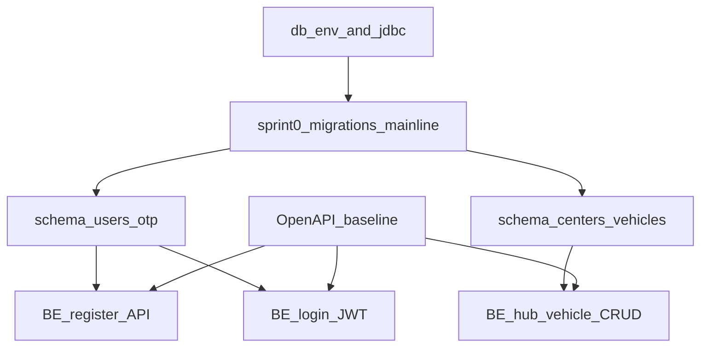

# 冲刺规划：调度与交付管理应用

## 1. 团队产能分析

| 名字          | 角色      | Github  (in style `@[username](link)` )                 |
| ------------- | --------- | ---------------------------------------------------- |
| @Hao Chen     | 组长      | @[JarrettChen217](https://github.com/JarrettChen217) |
| @Qiyuan Huang | 后端 Lead | @[qhuang258](https://github.com/qhuang258)           |
| @Yuyang Zhou  | 前端 Lead | @[YuyangZ1](https://github.com/YuyangZ1)             |
| @Lei Feng     | 组员      | @[leilfeng088](https://github.com/leilfeng088)       |
| @Jiayi Gao    | 组员      |                                                      |
| @Yiyuan Miao  | 组员      |                                                      |
| @Hangyi Gan   | 组员      |                                                      |
| @Yanjia Kan   | 组员      |                                                      |
|               |           |                                                      |


### 团队组成（建议角色）


| 角色                | 人数     | 每周小时/人 | 每周小时小计    | 进度  | 参与同学（含出勤/工时记录） |
| ----------------- | ------ | ------ | --------- | --- | -------------- |
| Scrum Master / PM | 1      | 3 小时   | 3 小时      | —   | —              |
| UI/UX 设计师         | 2      | 3 小时   | 6 小时      | —   | —              |
| 前端开发              | 3      | 3 小时   | 9 小时      | —   | —              |
| 后端开发              | 3      | 3 小时   | 9 小时      | —   | —              |
| QA / 测试工程师        | 1      | 3 小时   | 3 小时      | —   | —              |
| **总计**            | **10** |        | **30 小时** | —   | —              |


> 上表「进度」列为 **—**：表示角色/产能为规划基准，**非**可勾选任务状态。

### 每个冲刺的产能预算

```
┌──────────────────────────────────────────────────────┐
│             每周冲刺产能：30 小时                    │
│                                                      │
│  Scrum 仪式（站会、回顾、回顾）: -2 小时             │
│  有效开发产能                  : 28 小时             │
│                                                      │
│  ⚠️  每个冲刺内置缓冲，用于                           │
│     沟通开销和代码审查。                             │
└──────────────────────────────────────────────────────┘
```

---

## 1.5. 技术栈冻结与当前进度

团队已确认以下技术选型（与 [JavaBackendArchitecture.md](JavaBackendArchitecture.md) 一致），后续冲刺以此为准：

- **后端：** Java 17+，**Spring Boot**（Web、安全、数据访问）。
- **数据库：** **PostgreSQL**；服务区域与距离计算可在应用层用规则/经纬度实现，**PostGIS** 留作后续增强。
- **Schema 演进：** **Flyway** 或 **Liquibase**（团队选定其一后写入仓库约定）。
- **构建与依赖：** **Maven** 或 **Gradle**（与仓库一致）；使用 **Spring BOM** + **Wrapper** 锁定构建版本；小团队可指定负责人按双周或每月检视依赖升级（或与 Dependabot/Renovate 结合）。
- **API 契约：** 以 **OpenAPI（Swagger）** 为单一事实来源，与冲刺 0/1 的契约交付物对齐。

**进度说明（滚动更新）：**

- **已完成：** **Spring Boot** 应用脚手架（`backend/DeliveryManagement/`）；**ER / 数据库模式初稿**（见 [JavaBackendArchitecture.md](JavaBackendArchitecture.md) §3 及文末修订记录）；**Web 前端**工程壳与 MVP 路由、登录/注册 UI 占位（`frontend/`）。
- **冲刺 0 收尾（进行中）：** 后端数据库主线（PostgreSQL + Docker + JDBC、ER 对齐 schema、DTO/Service/DevRunner 验证），详见 [Sprint0Backlog.md](../Sprint0/Sprint0Backlog.md)。
- **后续衔接：** 冲刺 1 再接入认证、OpenAPI、前端联调与 UI/QA 配套事项，避免冲刺 0 目标发散。

---

## 2. 完整冲刺路线图（10 个冲刺 / 10 周）

```
第 1 周  ░░░░░░░░░░░░░░░░░░░░░░░░░░░░░░░░░░░░░░░░  冲刺 0：基础
第 2 周  🔴🔴🔴🔴🔴🔴🔴🔴🔴🔴🔴🔴🔴🔴🔴🔴🔴🔴🔴  冲刺 1：认证 + UI 外壳
第 3 周  🔴🔴🔴🔴🔴🔴🔴🔴🔴🔴🔴🔴🔴🔴🔴🔴🔴🔴🔴🔴  冲刺 2：地址 + 包裹
第 4 周  🔴🔴🔴🔴🔴🔴🔴🔴🔴🔴🔴🔴🔴🔴🔴🔴🔴🔴🔴🔴  冲刺 3：推荐引擎
第 5 周  🔴🔴🔴🔴🔴🔴🔴🔴🔴🔴🔴🔴🔴🔴🔴🔴🔴🔴🔴🔴  冲刺 4：结账 + 支付
第 6 周  🔴🔴🔴🔴🔴🔴🔴🔴🔴🔴🔴🔴🔴🔴🔴🔴🔴🔴🔴🔴  冲刺 5：跟踪 + MVP 完成 ✅
第 7 周  🟡🟡🟡🟡🟡🟡🟡🟡🟡🟡🟡🟡🟡🟡🟡🟡🟡🟡🟡🟡  冲刺 6：P1 第一轮
第 8 周  🟡🟡🟡🟡🟡🟡🟡🟡🟡🟡🟡🟡🟡🟡🟡🟡🟡🟡🟡🟡  冲刺 7：P1 第二轮
第 9 周  🟢🟢🟢🟢🟢🟢🟢🟢🟢🟢🟢🟢🟢🟢🟢🟢🟢🟢🟢🟢  冲刺 8：P2 + 打磨
第10 周  ⬜⬜⬜⬜⬜⬜⬜⬜⬜⬜⬜⬜⬜⬜⬜⬜⬜⬜⬜⬜  冲刺 9：QA + 演示准备
```

---

## 3. 详细冲刺分解

**「进度」列图例：** ✅ 已完成 · 🔄 进行中 · ⬜ 未开始 · ⏭️ 跳过/延后 · — 合计行或不适用。  
**§4 冲刺摘要：** 进度按**整冲刺**填写（当前冲刺可用 🔄）。**§5 角色矩阵**：可按成员填写职责落实或统一 ⬜。**§6 风险**：进度表示缓解措施是否已落地（未落实填 ⬜）。

---

### 冲刺 0 — 第 1 周：项目基础与架构

> **冲刺目标：** 仅完成后端数据库主线：`PostgreSQL + Docker + JDBC` 打通、按现有 ER 落库 schema、完成 DTO/Service/DevRunner 基线验证。

**任务顺序（后端）：** `T-0.11`（PG + Docker + JDBC + README）→ `T-0.12`（ER 对齐 schema SQL 建库）；`T-0.13`（DTO + Service + DevRunner 验证）延后到 Sprint 1 前期。


| 任务 ID  | 任务描述                                                                                                                  | 分配角色       | 预计小时      | 进度  | 参与同学（含出勤/工时记录）          |
| ------ | --------------------------------------------------------------------------------------------------------------------- | ---------- | --------- | --- | ----------------------- |
| T-0.11 | PostgreSQL 搭建：调研并落地 Docker（建议 docker compose）；接入 JDBC（Spring Data JDBC + PostgreSQL Driver + Flyway）；README 写清启动与连通验证 | 后端开发 × 1   | 4         | ✅   | @Lei Feng               |
| T-0.12 | 按现有 ER 编写 PostgreSQL schema SQL（`DROP TABLE IF EXISTS` + `CREATE TABLE`）并完成全库创建                                       | 后端开发 × 1   | 4         | ✅   | @Yuyang Zhou, @Lei Feng |
| T-0.13 | 按 ER 条目定义 DTO；为每个数据库实体建立 Service；增加 DevRunner 验证启动执行正确                                                                | 后端开发 × 1~2 | 6         | ⏭️  | —                       |
| T-0.14 | 使用vibe coding搭建前端框架，完成UI方面的设计和实现落地，并进行调试并确认完成。                                                                        | 前端开发 × 1   | 4         | ✅   | @Hao Chen               |
|        |                                                                                                                       | **冲刺总计**   | **12 小时** | —   | —                       |


**交付物：**

- 可复现 PostgreSQL 本地环境与 JDBC 连接（README 可直接指导新成员上手）
- ER 对齐的 schema SQL 可在 PostgreSQL 一次执行成功并完成建库
- DTO/Service/DevRunner 可在 `dev` 环境启动验证并输出可检查日志
- 冲刺 0 文档与执行项统一到 [Sprint0Backlog.md](../Sprint0/Sprint0Backlog.md)

> **本冲刺范围约束：** UI/UX、QA、OpenAPI、认证 API 等任务全部下放到后续冲刺，不占用 Sprint 0 工时。

**验收对齐（与 Sprint0Backlog 一致）：**

- `T-0.11`：README 可复现 PostgreSQL 启动、JDBC 连通和基本验证命令。
- `T-0.12`：schema SQL 在空库可一次执行成功，关键约束与 ER 一致。
- `T-0.13`：DTO/Service/DevRunner 在 `dev` 环境启动可验证且无启动级报错。

---

### 冲刺 1 — 第 2 周：用户认证 & 应用外壳 (🔴 P0)

> **冲刺目标：** 用户可以注册、登录并导航基本应用布局。3 个中心的后端数据层已运行。

#### 冲刺 1 组内依赖与并行轨道

**依赖链（数据与契约）：** 先完成 `T-0.11 ~ T-0.12` 的数据库主线（库可用 + schema 可用 + 数据层校验）；`T-0.13（延后任务）`在冲刺 1 前期完成；再进入注册、登录、Hub CRUD；OpenAPI 在冲刺 1 第 1 天冻结 baseline。

**减少互相等待的约定：**

1. **数据库第一责任人：** 冲刺第 1–2 个工作日内完成「可连库 + 含认证与 hub 所需对象的迁移」（可在冲刺 0 末启动 V1 延续为 V1.1/V2，但 **main 上仅允许迁移前进**、避免多人手写改库）。
2. **契约先行：** 冲刺 1 第 1 天合并 OpenAPI「注册 / 登录 / 中心车辆」baseline；字段变更走小步版本。
3. **后端并行：** 注册与登录可与 Hub CRUD **分人**；集成分支策略：**先合并迁移 PR，再合并依赖新表的 API PR**。
4. **前端并行：** 导航外壳、表单校验可先 **mock** 或对接 Stub；**前后端联调 + E2E** 集中在冲刺 **后半段固定时间盒**（例如最后 1–1.5 天），减少全周串行等待。
5. **设计与 QA：** 高保真线框与测试用例编写与 API 实现弱耦合，按计划并行。




| 用户故事       | 任务描述                                                                        | 分配角色               | 预计小时      | 进度  | 参与同学（含出勤/工时记录） |
| ---------- | --------------------------------------------------------------------------- | ------------------ | --------- | --- | -------------- |
| **US-1.1** | 后端：注册 API（邮箱/电话、OTP、密码哈希）；**须** `users` / OTP 等表已由迁移提供                      | 后端开发 × 2           | 4         | ⬜   | —              |
| **US-1.1** | 前端：注册屏幕 UI + 表单验证（可先 mock，后半周联调）                                            | 前端开发 × 1           | 3         | ⬜   | —              |
| **US-1.2** | 后端：登录 API（JWT、会话）；**依赖**同上用户表                                               | 后端开发 × 1           | 3         | ⬜   | —              |
| **US-1.2** | 前端：登录屏幕 UI + 错误处理（可先 mock）                                                  | 前端开发 × 1           | 3         | ⬜   | —              |
| —          | 前端：应用导航外壳（标签栏 / 侧边栏 / 路由）                                                   | 前端开发 × 1           | 3         | ⬜   | —              |
| —          | 前端：登陆 / 主页布局                                                                | 设计师 × 1 + 前端开发 × 1 | 4         | ⬜   | —              |
| —          | 后端：中心 & 车辆 **CRUD**；**须** `delivery_centers` / `fleet_vehicles`（或等价）表已由迁移提供 | 后端开发 × 1           | 3         | ⬜   | —              |
| —          | 设计：推荐屏幕 + 结账线框图（高保真）                                                        | 设计师 × 1            | 3         | ⬜   | —              |
| —          | QA：为注册 & 登录流程编写测试用例                                                         | QA 工程师             | 2         | ⬜   | —              |
|            |                                                                             | **冲刺总计**           | **28 小时** | —   | —              |


**交付物：**

- 工作的注册 + 登录流程（前端 ↔ 后端）
- JWT 认证激活
- 通过 API 访问中心/车辆数据
- 应用导航结构完整

---

### 冲刺 2 — 第 3 周：地址 & 包裹输入 (🔴 P0)

> **冲刺目标：** 用户可以在 SF 服务区域内输入验证的取货/送货地址，并描述包裹（尺寸/重量）。多步骤订单表单功能正常。


| 用户故事       | 任务描述                                    | 分配角色     | 预计小时      | 进度  | 参与同学（含出勤/工时记录） |
| ---------- | --------------------------------------- | -------- | --------- | --- | -------------- |
| **US-2.1** | 前端：带 Google Maps 自动完成 API 的地址输入字段       | 前端开发 × 2 | 6         | ⬜   | —              |
| **US-2.1** | 后端：存储并验证地址数据                            | 后端开发 × 1 | 2         | ⬜   | —              |
| **US-2.2** | 后端：地理围栏逻辑验证 SF 服务边界                     | 后端开发 × 1 | 3         | ⬜   | —              |
| **US-2.2** | 前端：显示超出区域地址的错误横幅                        | 前端开发 × 1 | 2         | ⬜   | —              |
| **US-3.1** | 前端：包裹尺寸选择器（视觉卡片）+ 重量输入字段                | 前端开发 × 1 | 3         | ⬜   | —              |
| **US-3.1** | 后端：包裹详情验证（无人机重量阈值）                      | 后端开发 × 1 | 2         | ⬜   | —              |
| —          | 前端：多步骤订单表单（步骤 1：地址 → 步骤 2：包裹 → 步骤 3：选项） | 前端开发 × 1 | 4         | ⬜   | —              |
| —          | 设计：跟踪屏幕线框图（高保真）                         | 设计师 × 2  | 4         | ⬜   | —              |
| —          | QA：测试地址验证、服务区域边缘案例                      | QA 工程师   | 2         | ⬜   | —              |
|            |                                         | **冲刺总计** | **28 小时** | —   | —              |


**交付物：**

- 带自动完成的地址输入
- 服务区域边界强制执行
- 包裹表单完全功能化
- 可导航的多步骤订单创建表单

---

### 冲刺 3 — 第 4 周：推荐引擎 (🔴 P0)

> **冲刺目标：** 系统计算最近中心，检查车辆可用性，并呈现分类的机器人 vs. 无人机交付选项，包括 ETA 和定价。


| 用户故事       | 任务描述                              | 分配角色     | 预计小时      | 进度  | 参与同学（含出勤/工时记录） |
| ---------- | --------------------------------- | -------- | --------- | --- | -------------- |
| **US-4.1** | 后端：最近中心算法（中心→取货→送货距离）             | 后端开发 × 2 | 6         | ⬜   | —              |
| **US-4.3** | 后端：每个中心的实时车辆可用性查询                 | 后端开发 × 1 | 3         | ⬜   | —              |
| **US-4.2** | 后端：ETA 计算（距离 ÷ 车辆速度）              | 后端开发 × 1 | 3         | ⬜   | —              |
| **US-4.2** | 后端：定价计算（基础费 + 距离费 + 服务费）          | 后端开发 × 1 | 3         | ⬜   | —              |
| **US-4.2** | 前端：交付选项卡片（机器人 vs 无人机）带最快/最便宜/最佳徽章 | 前端开发 × 2 | 6         | ⬜   | —              |
| **US-4.2** | 前端：灰显不可用选项并带原因工具提示                | 前端开发 × 1 | 2         | ⬜   | —              |
| —          | 设计：支付 & 确认屏幕（高保真）                 | 设计师 × 1  | 3         | ⬜   | —              |
| —          | QA：测试推荐逻辑的边缘案例（无车辆、重包裹）           | QA 工程师   | 2         | ⬜   | —              |
|            |                                   | **冲刺总计** | **28 小时** | —   | —              |


**交付物：**

- 推荐 API 按请求返回排序选项
- 前端显示交互式选项卡片
- 每个选项可见 ETA 和定价
- 不可用车辆正确灰显

---

### 冲刺 4 — 第 5 周：结账 & 支付 (🔴 P0)

> **冲刺目标：** 用户可以审查订单、安全支付，并收到带唯一订单 ID 的确认。


| 用户故事            | 任务描述                            | 分配角色     | 预计小时      | 进度  | 参与同学（含出勤/工时记录） |
| --------------- | ------------------------------- | -------- | --------- | --- | -------------- |
| **US-5.1**      | 前端：订单摘要审查屏幕（所有详情可编辑）            | 前端开发 × 2 | 5         | ⬜   | —              |
| **US-5.2**      | 后端：Stripe 支付网关集成                | 后端开发 × 2 | 6         | ⬜   | —              |
| **US-5.2**      | 前端：信用卡输入表单 + Stripe Elements UI | 前端开发 × 1 | 4         | ⬜   | —              |
| **US-5.2**      | 后端：支付成功时创建订单记录（生成订单 ID）         | 后端开发 × 1 | 3         | ⬜   | —              |
| **US-5.3 (P0)** | 前端：订单确认屏幕（订单 ID、ETA、“跟踪” CTA）   | 前端开发 × 1 | 3         | ⬜   | —              |
| —               | 后端：发送电子邮件/SMS 确认（可选存根）          | 后端开发 × 1 | 2         | ⬜   | —              |
| —               | 设计：交付后屏幕（历史、评分）                 | 设计师 × 1  | 3         | ⬜   | —              |
| —               | QA：测试完整结账管道（快乐路径 + 支付失败）        | QA 工程师   | 2         | ⬜   | —              |
|                 |                                 | **冲刺总计** | **28 小时** | —   | —              |


**交付物：**

- 从摘要到支付的完整结账流程
- Stripe 测试模式交易工作
- 生成并显示唯一订单 ID
- 带“跟踪我的交付”按钮的确认屏幕

---

### 冲刺 5 — 第 6 周：实时跟踪 + 移交 + 历史 (🔴 P0) — ✅ MVP 完成

> **冲刺目标：** 用户可以在实时地图上跟踪交付，收到解锁车辆的 PIN，并查看订单历史。**所有 P0 故事完成。MVP 可发布。**


| 用户故事       | 任务描述                            | 分配角色     | 预计小时      | 进度  | 参与同学（含出勤/工时记录） |
| ---------- | ------------------------------- | -------- | --------- | --- | -------------- |
| **US-6.1** | 前端：实时地图（Google Maps）带路线上的动画车辆图标 | 前端开发 × 2 | 7         | ⬜   | —              |
| **US-6.1** | 后端：模拟车辆位置更新（WebSocket 或轮询）      | 前端开发 × 2 | 5         | ⬜   | —              |
| **US-6.2** | 后端：调度时为每个订单生成唯一 4 位 PIN         | 后端开发 × 1 | 2         | ⬜   | —              |
| **US-6.2** | 前端：在跟踪屏幕显示 PIN / QR 码           | 前端开发 × 1 | 2         | ⬜   | —              |
| —          | 前端：订单状态进度条（5 个阶段）               | 前端开发 × 1 | 3         | ⬜   | —              |
| **US-7.1** | 后端：订单历史 API（列出用户过去订单）           | 后端开发 × 1 | 3         | ⬜   | —              |
| **US-7.1** | 前端：订单历史列表屏幕                     | 前端开发 × 1 | 3         | ⬜   | —              |
| —          | QA：端到端测试 — 从注册到交付的完整流程          | QA 工程师   | 3         | ⬜   | —              |
|            |                                 | **冲刺总计** | **28 小时** | —   | —              |


**交付物：**

- 🎉 **MVP 完成：** 完整管道 登录 → 订单 → 支付 → 跟踪 → 解锁 → 历史
- 带模拟车辆移动的实时地图跟踪
- 为包裹移交显示安全 PIN
- 订单历史页面功能正常

---

### 冲刺 6 — 第 7 周：P1 增强 — 第一轮 (🟡 应该有)

> **冲刺目标：** 通过社交登录、GPS 自动检测、保存地址和包裹自定义选项改善入驻体验。


| 用户故事       | 任务描述                       | 分配角色                | 预计小时      | 进度  | 参与同学（含出勤/工时记录） |
| ---------- | -------------------------- | ------------------- | --------- | --- | -------------- |
| **US-1.3** | 后端：Google/Apple OAuth2 集成  | 后端开发 × 2            | 5         | ⬜   | —              |
| **US-1.3** | 前端：社交登录按钮 + 重定向处理          | 前端开发 × 1            | 3         | ⬜   | —              |
| **US-1.4** | 前端：用户资料编辑屏幕                | 前端开发 × 1            | 2         | ⬜   | —              |
| **US-1.4** | 后端：更新用户资料 API              | 后端开发 × 1            | 2         | ⬜   | —              |
| **US-2.3** | 后端：保存地址的 CRUD              | 后端开发 × 1            | 2         | ⬜   | —              |
| **US-2.3** | 前端：地址簿 UI + 订单表单快速选择       | 前端开发 × 1            | 3         | ⬜   | —              |
| **US-2.4** | 前端：“使用我的位置” GPS 按钮 + 逆地理编码 | 前端开发 × 1            | 3         | ⬜   | —              |
| **US-3.2** | 前端：包裹表单上的“易碎”切换 + 后端逻辑     | 前端开发 × 1 + 后端开发 × 1 | 3         | ⬜   | —              |
| **US-3.3** | 前端：交付说明文本字段                | 前端开发 × 1            | 2         | ⬜   | —              |
| —          | QA：MVP 回归测试 + 新功能测试        | QA 工程师              | 3         | ⬜   | —              |
|            |                            | **冲刺总计**            | **28 小时** | —   | —              |


**交付物：**

- Google / Apple 登录工作
- 用户可以保存并重用地址
- GPS 位置自动检测功能正常
- 易碎标志影响推荐引擎输出

---

### 冲刺 7 — 第 8 周：P1 增强 — 第二轮 (🟡 应该有)

> **冲刺目标：** 添加推送通知、交付照片证明、促销码、评分系统和问题报告，完成 P1 功能集。


| 用户故事       | 任务描述                  | 分配角色                | 预计小时      | 进度  | 参与同学（含出勤/工时记录） |
| ---------- | --------------------- | ------------------- | --------- | --- | -------------- |
| **US-6.3** | 后端：2 分钟接近半径时的推送通知触发   | 后端开发 × 1            | 3         | ⬜   | —              |
| **US-6.3** | 前端：推送通知集成（FCM / APNs） | 前端开发 × 1            | 3         | ⬜   | —              |
| **US-6.4** | 后端：模拟交付照片上传 + 存储      | 后端开发 × 1            | 3         | ⬜   | —              |
| **US-6.4** | 前端：在跟踪 & 历史中显示交付照片    | 前端开发 × 1            | 2         | ⬜   | —              |
| **US-5.3** | 后端：促销码验证 API          | 后端开发 × 1            | 3         | ⬜   | —              |
| **US-5.3** | 前端：结账时的促销码输入字段        | 前端开发 × 1            | 2         | ⬜   | —              |
| **US-7.2** | 前端：交付后星级评分提示 + API    | 前端开发 × 1 + 后端开发 × 1 | 3         | ⬜   | —              |
| **US-7.3** | 前端：“报告问题”表单 + 工单 API  | 前端开发 × 1 + 后端开发 × 1 | 4         | ⬜   | —              |
| —          | MVP 和冲刺 6 的 bug 修复    | 所有开发                | 3         | ⬜   | —              |
| —          | QA：回归 + 新功能测试         | QA 工程师              | 2         | ⬜   | —              |
|            |                       | **冲刺总计**            | **28 小时** | —   | —              |


**交付物：**

- 推送通知在车辆到达前警报用户
- 订单详情中可见交付照片
- 结账时应用促销码折扣
- 交付后评分和问题报告功能正常
- **所有 P1 故事完成 ✅**

---

### 冲刺 8 — 第 9 周：P2 高级功能 + UI 打磨 (🟢 不错有)

> **冲刺目标：** 添加竞争差异化功能（天气限制、数字钱包、碳足迹）并打磨整体 UI 以准备演示。


| 用户故事       | 任务描述                                  | 分配角色                | 预计小时      | 进度  | 参与同学（含出勤/工时记录） |
| ---------- | ------------------------------------- | ------------------- | --------- | --- | -------------- |
| **US-4.4** | 后端：天气 API 集成（OpenWeatherMap）+ 无人机禁用逻辑 | 后端开发 × 2            | 5         | ⬜   | —              |
| **US-4.4** | 前端：无人机选项卡上的天气警告徽章                     | 前端开发 × 1            | 2         | ⬜   | —              |
| **US-5.4** | 前端：Apple Pay / Google Pay 集成          | 前端开发 × 1 + 后端开发 × 1 | 4         | ⬜   | —              |
| **US-1.5** | 前端 + 后端：访客结账流程（无需账户）                  | 前端开发 × 1 + 后端开发 × 1 | 4         | ⬜   | —              |
| **US-7.4** | 前端：交付后屏幕上的碳足迹卡片                       | 前端开发 × 1            | 2         | ⬜   | —              |
| —          | UI 打磨：动画、加载状态、响应式布局                   | 设计师 × 2 + 前端开发 × 1  | 6         | ⬜   | —              |
| —          | 后端：性能优化、API 响应缓存                      | 后端开发 × 1            | 3         | ⬜   | —              |
| —          | QA：完整功能集回归                            | QA 工程师              | 2         | ⬜   | —              |
|            |                                       | **冲刺总计**            | **28 小时** | —   | —              |


**交付物：**

- 恶劣天气下禁用/警告无人机选项
- 数字钱包支付选项可用
- 访客用户无需注册即可下单
- 所有屏幕打磨、演示就绪 UI

---

### 冲刺 9 — 第 10 周：最终 QA、集成测试 & 演示准备

> **冲刺目标：** 确保整个应用稳定、无 bug，并准备好最终演示或提交。


| 任务 ID | 任务描述                  | 分配角色                    | 预计小时      | 进度  | 参与同学（含出勤/工时记录） |
| ----- | --------------------- | ----------------------- | --------- | --- | -------------- |
| T-9.1 | 端到端集成测试（所有用户流程、所有路径）  | QA + 所有开发               | 8         | ⬜   | —              |
| T-9.2 | Bug 分级和关键 bug 修复      | 前端开发 × 2 + 后端开发 × 2     | 6         | ⬜   | —              |
| T-9.3 | 编写最终项目文档（README、设置指南） | Scrum Master + 后端开发 × 1 | 3         | ⬜   | —              |
| T-9.4 | 准备演示脚本和演示幻灯片          | Scrum Master + 设计师 × 2  | 5         | ⬜   | —              |
| T-9.5 | 录制演示视频（实时演示失败时的备份）    | 设计师 × 1 + 前端开发 × 1      | 3         | ⬜   | —              |
| T-9.6 | 为演示进行最终数据填充和环境清理      | 后端开发 × 1                | 2         | ⬜   | —              |
| T-9.7 | 团队实时演示排练              | 全体                      | 1         | ⬜   | —              |
|       |                       | **冲刺总计**                | **28 小时** | —   | —              |


**交付物：**

- 🎉 **生产就绪应用**
- 零关键/高严重性 bug
- 演示幻灯片完成
- 演示视频录制
- 最终项目文档提交

---

## 4. 冲刺摘要仪表板


| 冲刺  | 周   | 阶段    | 覆盖故事                                                            | 累计完成           | 进度  | 参与同学（含出勤/工时记录） |
| --- | --- | ----- | --------------------------------------------------------------- | -------------- | --- | -------------- |
| 0   | 1   | ░ 基础  | T-0.11/T-0.12/T-0.14：PG+Docker+JDBC、ER Schema、前端框架（vibe coding） | 数据层就绪          | 🔄  | —              |
| 1   | 2   | 🔴 P0 | US-1.1, US-1.2                                                  | 认证完成           | ⬜   | —              |
| 2   | 3   | 🔴 P0 | US-2.1, US-2.2, US-3.1                                          | 输入完成           | ⬜   | —              |
| 3   | 4   | 🔴 P0 | US-4.1, US-4.2, US-4.3                                          | 引擎完成           | ⬜   | —              |
| 4   | 5   | 🔴 P0 | US-5.1, US-5.2, US-5.3 (确认)                                     | 结账完成           | ⬜   | —              |
| 5   | 6   | 🔴 P0 | US-6.1, US-6.2, US-7.1                                          | **✅ MVP 可发布**  | ⬜   | —              |
| 6   | 7   | 🟡 P1 | US-1.3, US-1.4, US-2.3, US-2.4, US-3.2, US-3.3                  | 增强输入           | ⬜   | —              |
| 7   | 8   | 🟡 P1 | US-5.3 (促销), US-6.3, US-6.4, US-7.2, US-7.3                     | **✅ 所有 P1 完成** | ⬜   | —              |
| 8   | 9   | 🟢 P2 | US-1.5, US-4.4, US-5.4, US-7.4 + UI 打磨                          | 高级功能           | ⬜   | —              |
| 9   | 10  | ⬜ QA  | 集成测试、Bug 修复、演示准备                                                | **🚀 发布就绪**    | ⬜   | —              |


---

## 5. 建议角色分配矩阵

> 每个冲刺，每个团队成员应有明确所有权。下面是建议映射。

> **脚注：** 若后端人手紧张，可将「**PostgreSQL + 迁移**」与「契约 / 功能开发」合并到更少的人身上，但仍须指定 **唯一迁移合并负责人**，并在 `main` 上坚持 **仅向前迁移**（见 §6），以免多人手写改库导致联调阻塞。


| 成员 # | 角色               | 冲刺 0                                            | 冲刺 1-5 (P0)                    | 冲刺 6-7 (P1)   | 冲刺 8-9 (P2/QA)   | 进度  | 参与同学（含出勤/工时记录） |
| ---- | ---------------- | ----------------------------------------------- | ------------------------------ | ------------- | ---------------- | --- | -------------- |
| 1    | **Scrum Master** | 板设置、仪式                                          | 主持站会、移除障碍                      | 主持、跟踪速度       | 文档、演示脚本          | ⬜   | —              |
| 2    | **UI/UX 设计师 A**  | 线框图 (认证、订单)                                     | 跟踪、支付高保真样图                     | 打磨、微交互        | 演示幻灯片            | ⬜   | —              |
| 3    | **UI/UX 设计师 B**  | 线框图 (推荐、跟踪)                                     | 历史、评分高保真样图                     | 响应式设计审计       | 演示视频制作           | ⬜   | —              |
| 4    | **前端开发 A**       | 项目脚手架                                           | 认证屏幕、导航外壳                      | 社交登录 UI、资料    | 访客结账、UI 打磨       | ⬜   | —              |
| 5    | **前端开发 B**       | —                                               | 地址输入、包裹表单                      | 保存地址、GPS      | 天气徽章、数字钱包        | ⬜   | —              |
| 6    | **前端开发 C**       | —                                               | 推荐卡片、结账                        | 推送通知、照片       | 碳足迹、动画           | ⬜   | —              |
| 7    | **后端开发 A**       | **T-0.11**（PostgreSQL + Docker + JDBC + README） | 认证 API (注册、登录、JWT)             | OAuth、资料 API  | 天气 API、缓存        | ⬜   | —              |
| 8    | **后端开发 B**       | **T-0.12**（ER 对齐 schema SQL 与建库）                | 中心算法、车辆可用性                     | 保存地址 API、易碎逻辑 | 访客订单逻辑           | ⬜   | —              |
| 9    | **后端开发 C**       | —                                               | T-0.13（延后）+ 支付 (Stripe)、订单 API | 促销码、评分、问题 API | Apple/Google Pay | ⬜   | —              |
| 10   | **QA 工程师**       | 测试策略文档                                          | 每个冲刺测试用例、E2E MVP 测试            | 回归 + P1 测试    | 最终集成测试           | ⬜   | —              |


---

## 6. 风险登记 & 缓解


| 风险                   | 可能性 | 影响  | 缓解策略                                                     | 进度  | 参与同学（含出勤/工时记录） |
| -------------------- | --- | --- | -------------------------------------------------------- | --- | -------------- |
| Google Maps API 配额超限 | 中等  | 高   | 使用免费层密钥；缓存地理编码结果；开发中模拟                                   | ⬜   | —              |
| **数据库迁移与联调顺序混乱**     | 中等  | 高   | 指定 **单一迁移负责人**；`main` **仅向前迁移**；先合并迁移再合并依赖新表的 API；避免手写漂移 | ⬜   | —              |
| Stripe 集成复杂性         | 中等  | 高   | 全程使用 Stripe 测试模式；实现模拟支付回退                                | ⬜   | —              |
| 实时地图跟踪性能问题           | 中等  | 中等  | 如需使用轮询（每 5s）代替 WebSocket；模拟车辆位置                          | ⬜   | —              |
| 团队成员可用性降至每周 3 小时以下   | 高   | 中等  | P2 故事作为缓冲 — 可丢弃而不影响 MVP                                  | ⬜   | —              |
| 新功能想法导致范围蔓延          | 中等  | 中等  | Scrum Master 在冲刺规划后强制冲刺待办冻结                              | ⬜   | —              |


---

> 计划保证**第 6 周（冲刺 5）完成完全功能化的 MVP**。

