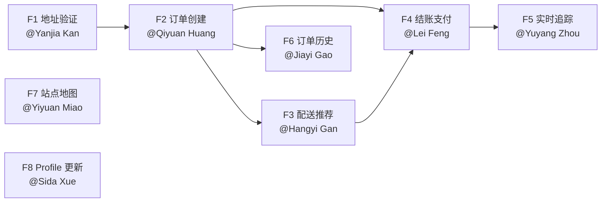

# 最终冲刺 — MVP 全链路任务分配

> **截止日期：** 1 周后（Demo 当天）  
> **目标：** 打通完整用户旅程，实现可演示的 MVP

---

## 进度图例

| 符号 | 含义 |
|------|------|
| 🔴 | 未开始 |
| 🟡 | 进行中 |
| 🟢 | 已完成 |

---

## 当前状态

### ✅ 已完成（无需重做）

| 层次 | 完成内容 |
|------|---------|
| 数据库 | 全部 7 张表已建好，种子数据（3个配送站、9辆车）已写入 |
| 后端 Entity | `AppUserEntity`、`OtpChallengeEntity`、`DeliveryCenterEntity`、`FleetVehicleEntity`、`OrderEntity`、`OrderParcelEntity`、`PaymentEntity` |
| 后端 Repository | 全部 7 个 Repository，含自定义查询（`findByUserId`、`findByAvailable` 等） |
| 后端 Service | 全部 7 个 Service，含基础 CRUD |
| 后端 Controller | `AuthController`（注册/OTP/登录/me）、`DeliveryCenterController`（GET /centers、GET /centers/{id}/vehicles）|
| 前端页面 | LoginPage、RegisterPage、HomePage、OrderWizardPage（3步表单，已拉取中心列表）|
| 前端 Stub | RecommendationsPage、CheckoutReviewPage、PaymentPage、OrderConfirmationPage、OrderHistoryPage、TrackingPage（有 UI，硬编码数据，待接入后端）|
| 前端 API 客户端 | `api/client.ts`：已实现 Auth + Centers + Vehicles 相关函数 |

### ❌ 还需完成

| 编号 | 任务 | 负责人 |
|------|------|--------|
| F1 | 地址验证全链路 | @Yanjia Kan |
| F2 | 订单创建全链路 | @Qiyuan Huang |
| F3 | 配送推荐全链路 | @Hangyi Gan |
| F4 | 结账支付全链路 | @Lei Feng |
| F5 | 实时追踪全链路 | @Yuyang Zhou |
| F6 | 订单历史全链路 | @Jiayi Gao |
| F7 | 站点地图（纯前端）| @Yiyuan Miao |
| F8 | 用户 Profile 更新 | @Sida Xue |

---

## MVP 用户旅程

```
[登录/注册]
    ↓
[填写收货地址] ──→ F1: POST /validate/address ──→ 服务区验证提示
    ↓（通过）
[选择包裹信息]
    ↓
[提交] ──→ F2: POST /orders + POST /orders/{id}/parcels ──→ 得到 orderId
    ↓
[查看推荐方案] ──→ F3: POST /plan ──→ 车型/ETA/价格
    ↓
[确认 & 支付] ──→ F4: POST /orders/{id}/pay ──→ handoffPin + 状态变 IN_TRANSIT
    ↓
[订单确认页] ──→ 显示 PIN 码 + ETA
    ↓
[实时追踪] ──→ F5: GET /orders/{id}/tracking (轮询) ──→ 地图动态位置
    ↓
[历史订单] ──→ F6: GET /orders/me ──→ 订单列表

[独立] 站点地图 ──→ F7: GET /centers (已有) ──→ Google Maps 标记
[独立] Profile ──→ F8: PUT /users/me ──→ 更新姓名/手机
```

---

## 任务总览

| 任务 | 描述 | 负责人 | 估时 | 依赖 | 优先级 |
|------|------|--------|------|------|--------|
| F1 | 地址验证全链路 | @Yanjia Kan | 1.5 天 | 无（Day 1） | P0 |
| F2 | 订单创建全链路 | @Qiyuan Huang | 2 天 | F1 | P0 🔑 |
| F3 | 配送推荐全链路 | @Hangyi Gan | 2 天 | F2 | P0 🔑 |
| F4 | 结账支付全链路 | @Lei Feng | 2 天 | F2 + F3 | P0 🔑 |
| F5 | 实时追踪全链路 | @Yuyang Zhou | 2 天 | F4 | P0 🔑 |
| F6 | 订单历史全链路 | @Jiayi Gao | 1 天 | F2 | P0 |
| F7 | 站点地图（纯前端）| @Yiyuan Miao | 1.5 天 | 无（Day 1） | P1 |
| F8 | 用户 Profile 更新 | @Sida Xue | 1.5 天 | 无（Day 1） | P1 |

---

## 详细任务说明

---

### F1 — 地址验证全链路 🔴
**负责人：** @Yanjia Kan  
**估时：** 1.5 天  
**可并行开始：** Day 1

#### 后端

新建文件：
- `validation/AddressValidationService.java`
- `validation/AddressController.java`
- `validation/AddressValidateRequest.java`（record）
- `validation/AddressValidateResponse.java`（record）

**API：** `POST /api/v1/validate/address`
```json
// Request
{ "address": "123 Market St, San Francisco, CA", "lat": 37.7749, "lng": -122.4194 }

// Response（在服务区）
{ "valid": true, "message": "Address is within the service area" }

// Response（不在服务区）
{ "valid": false, "message": "Address is outside our San Francisco service area" }
```

**AddressValidationService 实现要点：**
```java
// SF 服务区多边形（4顶点硬编码即可，覆盖 SF 主城区）
private static final double[][] SF_POLYGON = {
    {37.8120, -122.5150}, // NW
    {37.8120, -122.3550}, // NE
    {37.7080, -122.3550}, // SE
    {37.7080, -122.5150}  // SW
};
// 射线法判断点是否在多边形内
```

#### 前端

修改文件：`frontend/src/pages/order/OrderWizardPage.tsx`

- 用户在地址输入框填写地址后，调用 `POST /validate/address`
- 在地址栏下方显示：
  - 绿色标签 "✓ 在服务区内"（valid=true）
  - 红色标签 "✗ 不在服务区"（valid=false）
- 无效地址时，"下一步"按钮置灰禁用

在 `api/client.ts` 中新增：
```typescript
export async function validateAddress(payload: { address: string; lat?: number; lng?: number }): Promise<{ valid: boolean; message: string }>
```

#### DoD
- [ ] `POST /validate/address`：SF 市中心地址返回 `valid: true`
- [ ] `POST /validate/address`：纽约地址返回 `valid: false`
- [ ] 前端地址步骤：无效地址时下一步按钮不可点击

---

### F2 — 订单创建全链路 🔴
**负责人：** @Qiyuan Huang  
**估时：** 2 天  
**依赖：** F1（地址验证通过后才提交）

#### 后端

新建文件：
- `order/CreateOrderRequest.java`（record）
- `order/CreateParcelRequest.java`（record）
- `order/OrderController.java`

复用（无需修改）：`OrderService`、`OrderRepository`、`OrderParcelService`、`OrderParcelRepository`

**API：**

`POST /api/v1/orders`（需 JWT）
```json
// Request
{
  "pickupAddress": "SoMa Hub, 100 Howard St, San Francisco",
  "pickupLat": 37.7879, "pickupLng": -122.3965,
  "dropoffAddress": "456 Castro St, San Francisco, CA",
  "dropoffLat": 37.7609, "dropoffLng": -122.4350
}

// Response 201
{ "orderId": "uuid", "status": "PENDING", "createdAt": "..." }
```

`POST /api/v1/orders/{orderId}/parcels`（需 JWT）
```json
// Request
{ "sizeTier": "M", "weightKg": 2.5, "fragile": false, "deliveryNotes": "" }

// Response 201
{ "parcelId": "uuid", "orderId": "uuid", "sizeTier": "M", "weightKg": 2.5 }
```

**实现要点：**
- `@AuthenticationPrincipal AuthenticatedUser` 取 userId（参考 `AuthController.getMe()`）
- 创建 Order 时 status 设为 `PENDING`，centerId/fleetVehicleId 暂为 null（由 F4 支付时分配）
- 错误格式与现有保持一致（参考 `GlobalExceptionHandler`）

#### 前端

修改文件：`frontend/src/pages/order/OrderWizardPage.tsx`

- 最后一步"确认提交"按钮：
  1. 调用 `createOrder()`（地址信息）
  2. 得到 `orderId` 后调用 `addParcel(orderId, parcelInfo)`
  3. 成功后跳转 `/recommendations?orderId={orderId}`

  在 `api/client.ts` 中新增：
```typescript
export async function createOrder(payload: CreateOrderRequest): Promise<{ orderId: string }>
export async function addParcel(orderId: string, payload: CreateParcelRequest): Promise<{ parcelId: string }>
```

#### DoD
- [ ] 已登录用户可创建订单，返回 orderId（UUID）
- [ ] 添加包裹成功，返回 parcelId
- [ ] 未登录请求返回 401
- [ ] 前端提交后携带 orderId 跳转到推荐页

---

### F3 — 配送推荐全链路 🔴
**负责人：** @Hangyi Gan  
**估时：** 2 天  
**依赖：** F2

#### 后端

新建文件：
- `plan/PlanRequest.java`（record）
- `plan/PlanResponse.java`（record）
- `plan/PlanController.java`
- `plan/PlanningService.java`

复用（无需修改）：`DeliveryCenterService`、`DeliveryCenterRepository`、`FleetVehicleService`

**API：** `POST /api/v1/plan`（需 JWT）
```json
// Request
{ "orderId": "uuid", "dropoffLat": 37.7609, "dropoffLng": -122.4350 }

// Response 200
[
  {
    "vehicleType": "ROBOT",
    "centerId": "uuid",
    "centerName": "SoMa Hub",
    "etaMinutes": 35,
    "priceUsd": 12.50
  },
  {
    "vehicleType": "DRONE",
    "centerId": "uuid",
    "centerName": "Mission Hub",
    "etaMinutes": 18,
    "priceUsd": 19.00
  }
]
```

**PlanningService 实现要点：**
```java
// 1. 找最近 DeliveryCenter（Haversine 公式）
double distKm = haversine(centerLat, centerLng, dropoffLat, dropoffLng);

// 2. 车型匹配（根据包裹 sizeTier）
// S / M → 优先推荐 ROBOT（同时也返回 DRONE 选项）
// L → 只推荐 DRONE

// 3. ETA 公式
// ROBOT: distKm / 15.0 * 60 + 10  （15 km/h + 10 分钟取货缓冲）
// DRONE: distKm / 40.0 * 60 + 10  （40 km/h + 10 分钟起飞缓冲）

// 4. 价格公式
// ROBOT: 5.0 + weightKg * 2.0 + distKm * 1.0
// DRONE: 8.0 + weightKg * 1.5 + distKm * 2.0
```

#### 前端

修改文件：`frontend/src/pages/checkout/RecommendationsPage.tsx`

- 页面加载时读取 URL param `orderId`
- 调用 `POST /plan`，传入 orderId + dropoff 坐标（从 sessionStorage 读取）
- 替换硬编码数据，显示真实 ETA/价格
- "选择此方案"按钮：将 `{ vehicleType, priceUsd, etaMinutes, centerId }` 存入 sessionStorage，跳转 `/checkout?orderId={orderId}`

在 `api/client.ts` 中新增：
```typescript
export async function getPlan(payload: { orderId: string; dropoffLat: number; dropoffLng: number }): Promise<PlanOption[]>
```

#### DoD
- [ ] `POST /plan` 根据包裹尺寸返回匹配车型方案
- [ ] ETA 和价格为计算值（非硬编码）
- [ ] 前端显示真实 ETA/价格，"选择"后携带方案跳转结账页

---

### F4 — 结账支付全链路 🔴
**负责人：** @Lei Feng  
**估时：** 2 天  
**依赖：** F2 + F3

#### 后端

在 `OrderController` 中新增端点（或新建 `PaymentController`）：

**API：** `POST /api/v1/orders/{orderId}/pay`（需 JWT）
```json
// Request
{ "vehicleType": "ROBOT", "priceUsd": 12.50 }

// Response 200
{
  "orderId": "uuid",
  "handoffPin": "847293",
  "vehicleType": "ROBOT",
  "etaMinutes": 35,
  "totalAmount": 12.50,
  "currency": "USD"
}
```

**实现步骤：**

1. 验证订单属于当前用户（userId 匹配）
2. 找最近有可用车辆的 DeliveryCenter（复用 F3 逻辑，或直接读 planSnapshot）
3. 分配一辆可用的 FleetVehicle（`FleetVehicleRepository.findByCenterId()` + 取第一个 available=true 的）
4. 生成 `handoffPin`（6 位随机数字：`String.format("%06d", random.nextInt(1_000_000))`）
5. 更新 Order：`status=IN_TRANSIT`、`centerId`、`fleetVehicleId`、`handoffPin`、`estimatedMinutes`、`totalAmount`
6. 将分配的 FleetVehicle 标记为 `available=false`
7. 创建 Payment 记录（`status=SUCCEEDED`，`idempotencyKey=UUID.randomUUID()`）
8. 返回确认信息

复用：`PaymentService`、`FleetVehicleService`、`OrderService`

#### 前端

修改文件：
- `frontend/src/pages/checkout/CheckoutReviewPage.tsx`
- `frontend/src/pages/checkout/PaymentPage.tsx` (或合并为一页)
- `frontend/src/pages/checkout/OrderConfirmationPage.tsx`

**CheckoutReviewPage：**
- 从 sessionStorage 读取 orderId + planChoice（vehicleType/price/eta）
- 展示订单摘要：地址、包裹信息、选择的方案、价格

**PaymentPage：**
- 点击"立即支付 $xx.xx"按钮 → 调用 `POST /orders/{id}/pay`
- Loading 状态显示"处理中..."

**OrderConfirmationPage：**
- 接收返回值，显示：
  - ✅ 订单已确认
  - PIN 码：`847293`（大字显示，用于取件验证）
  - 预计送达：35 分钟
  - 按钮："追踪配送" → `/orders/{orderId}/tracking`

  在 `api/client.ts` 中新增：
```typescript
export async function payOrder(orderId: string, payload: { vehicleType: string; priceUsd: number }): Promise<PaymentConfirmation>
```

#### DoD
- [ ] `POST /orders/{id}/pay` 返回 handoffPin（6位数字）
- [ ] Order 状态变为 `IN_TRANSIT`，FleetVehicle 标记为不可用
- [ ] Payment 记录状态为 `SUCCEEDED`
- [ ] 前端确认页显示真实 PIN 码 + ETA
- [ ] 重复调用同一 orderId 应返回 409 Conflict（幂等保护）

---

### F5 — 实时追踪全链路 🔴
**负责人：** @Yuyang Zhou  
**估时：** 2 天  
**依赖：** F4（需要 IN_TRANSIT 状态的订单）

#### 后端

新建文件：
- `tracking/TrackingController.java`
- `tracking/TrackingResponse.java`（record）

复用（无需修改）：`OrderRepository`（已有 simLatitude/simLongitude/simHeadingDeg/simUpdatedAt 字段）

**API：** `GET /api/v1/orders/{orderId}/tracking`（需 JWT）
```json
// Response 200（进行中）
{
  "orderId": "uuid",
  "status": "IN_TRANSIT",
  "vehicleType": "ROBOT",
  "simLat": 37.7740,
  "simLng": -122.4200,
  "simHeadingDeg": 225.0,
  "etaMinutes": 22
}

// Response 200（已送达）
{
  "orderId": "uuid",
  "status": "DELIVERED",
  "vehicleType": "ROBOT",
  "simLat": 37.7609,
  "simLng": -122.4350,
  "etaMinutes": 0
}
```

**模拟位置移动逻辑（每次 GET 调用时执行）：**
```java
// 1. 读取当前 sim 位置和 dropoff 目标位置
// 2. 计算向量方向 (dropoff - current)
// 3. 移动一小步：delta = 0.001 度（约 100 米）
double dLat = dropoffLat - simLat;
double dLng = dropoffLng - simLng;
double dist = Math.sqrt(dLat*dLat + dLng*dLng);
if (dist < 0.002) {
    // 到达目的地
    order.setStatus("DELIVERED");
    order.setSimLat(dropoffLat); order.setSimLng(dropoffLng);
} else {
    double step = 0.001 / dist;
    order.setSimLat(simLat + dLat * step);
    order.setSimLng(simLng + dLng * step);
}
// 4. 更新 Order 记录
// 5. 计算剩余 etaMinutes（dist * 111 km/degree / speed * 60）
```

**首次追踪（simLat/simLng 为 null 时）：** 从分配的 DeliveryCenter 位置开始

#### 前端

修改文件：`frontend/src/pages/tracking/TrackingPage.tsx`

- 页面加载：从 URL 参数读取 `orderId`
- 每 **3 秒**调用一次 `GET /orders/{orderId}/tracking`
- 用 Google Maps `Marker` 更新车辆位置（每次更新 `marker.setPosition()`）
- 显示 Order 状态进度步骤：配送中 → 已送达
- 送达后停止轮询，显示"配送完成"提示

在 `api/client.ts` 中新增：
```typescript
export async function getTracking(orderId: string): Promise<TrackingState>
```

#### DoD
- [ ] 每次 GET 请求位置向目的地移动一步
- [ ] 到达目的地后 status 自动变为 `DELIVERED`
- [ ] 前端每 3 秒更新地图标记位置
- [ ] 送达后轮询停止，显示完成状态

---

### F6 — 订单历史全链路 🔴
**负责人：** @Jiayi Gao  
**估时：** 1 天  
**依赖：** F2（OrderController 需存在）

#### 后端

在 `OrderController` 中新增端点：

**API：** `GET /api/v1/orders/me`（需 JWT）
```json
// Response 200
[
  {
    "orderId": "uuid",
    "status": "DELIVERED",
    "dropoffSummary": "456 Castro St, San Francisco",
    "vehicleTypeChosen": "ROBOT",
    "totalAmount": 12.50,
    "currency": "USD",
    "createdAt": "2026-04-13T10:30:00Z"
  }
]
```

**实现：**
```java
@GetMapping("/me")
public Flux<OrderSummaryResponse> getMyOrders(@AuthenticationPrincipal AuthenticatedUser user) {
    return orderService.findByUserId(user.id())
        .map(order -> new OrderSummaryResponse(...));
}
```

复用：`OrderService.findByUserId()`（已实现）

#### 前端

修改文件：`frontend/src/pages/history/OrderHistoryPage.tsx`

- 页面加载时调用 `GET /orders/me`
- 替换硬编码 demo 订单，显示真实数据
- 状态颜色：`DELIVERED`→绿色，`IN_TRANSIT`→蓝色，`PENDING`→橙色，`CANCELLED`→红色
- 每行右侧：`DELIVERED` 显示"查看详情"，`IN_TRANSIT` 显示"追踪" → `/orders/{id}/tracking`

在 `api/client.ts` 中新增：
```typescript
export async function getMyOrders(): Promise<OrderSummary[]>
```

#### DoD
- [ ] `GET /orders/me` 返回当前用户的真实订单列表
- [ ] 前端历史页替换掉硬编码数据
- [ ] IN_TRANSIT 状态订单有"追踪"跳转链接

---

### F7 — 站点地图（纯前端）🔴
**负责人：** @Yiyuan Miao  
**估时：** 1.5 天  
**可并行开始：** Day 1（后端 API 已完成）

#### 后端

**无需任何后端工作！** 以下 API 已完全实现：
- `GET /api/v1/centers` — 返回 3 个 SF 配送站（含 lat/lng）
- `GET /api/v1/centers/{id}/vehicles` — 返回该站车辆列表

#### 前端

在 `HomePage` 中添加"配送站点"板块，**或**新建 `/depots` 页面并加入导航。

**功能要求：**
1. 页面加载调用 `fetchCenters()`（`api/client.ts` 中已实现）
2. 对每个 center 调用 `fetchVehicles(centerId)`（已实现）统计可用车辆数
3. Google Maps 显示 3 个标记（Marker），位置为各站点 lat/lng
4. 点击标记弹出 InfoWindow，显示：
   - 站点名称（如 "SoMa Hub"）
   - 地址（addressLine）
   - 可用无人机 🚁 N 架
   - 可用机器人 🤖 N 台

   **已有函数（直接复用）：**
```typescript
// api/client.ts（已实现）
fetchCenters() → DeliveryCenter[]
fetchVehicles(centerId) → FleetVehicle[]
```

#### DoD
- [ ] 地图显示 3 个 SF 站点标记
- [ ] 点击标记展示站点名称 + 可用车辆数量
- [ ] 数据来自真实 API（非硬编码）

---

### F8 — 用户 Profile 更新全链路 🔴
**负责人：** @Sida Xue  
**估时：** 1.5 天  
**可并行开始：** Day 1（独立，无依赖）

#### 后端

新建文件：
- `user/UserController.java`
- `user/UpdateProfileRequest.java`（record：`fullName`、`phone`）

复用：`AppUserService`（已实现）

**API：**

`GET /api/v1/users/me`（需 JWT）— 可直接复用 `/auth/me` 返回值格式

`PUT /api/v1/users/me`（需 JWT）
```json
// Request
{ "fullName": "Alice Wang", "phone": "+14155551234" }

// Response 200
{ "id": "uuid", "email": "alice@example.com", "phone": "+14155551234", "fullName": "Alice Wang" }
```

**实现：**
```java
@PutMapping("/me")
public Mono<AppUserSummary> updateProfile(
    @AuthenticationPrincipal AuthenticatedUser user,
    @RequestBody UpdateProfileRequest req
) {
    return appUserService.updateProfile(user.id(), req.fullName(), req.phone());
}
```

在 `AppUserService` 中新增 `updateProfile()` 方法（参考已有 `createUser()` 写法）。

#### 前端

修改文件：`frontend/src/pages/ProfilePage.tsx`（当前为空 stub）

**功能要求：**
1. 页面加载时调用 `GET /auth/me`，填充 fullName 和 phone 表单字段
2. 点击"保存"→ 调用 `PUT /users/me`
3. 成功后显示绿色成功提示"个人信息已更新"
4. email 字段只读（不允许修改）

在 `api/client.ts` 中新增：
```typescript
export async function updateProfile(payload: { fullName: string; phone: string }): Promise<AppUserSummary>
```

#### DoD
- [ ] `PUT /users/me` 更新 fullName 和 phone 并返回最新信息
- [ ] 不允许修改 email（后端忽略 email 字段，前端显示为只读）
- [ ] 前端 ProfilePage 从 stub 变为真实功能页
- [ ] 保存成功显示提示

---

## 依赖关系图



**并行开始（Day 1）：** F1、F7、F8  
**关键路径：** F1 → F2 → F3 → F4 → F5

---

## 分支策略

```
main
└── develop
    ├── feature/fs-f1-address-validation        (@Yanjia Kan)
    ├── feature/fs-f2-order-creation            (@Qiyuan Huang)
    ├── feature/fs-f3-plan-recommendation       (@Hangyi Gan)
    ├── feature/fs-f4-checkout-payment          (@Lei Feng)
    ├── feature/fs-f5-realtime-tracking         (@Yuyang Zhou)
    ├── feature/fs-f6-order-history             (@Jiayi Gao)
    ├── feature/fs-f7-depot-map                 (@Yiyuan Miao)
    └── feature/fs-f8-profile-update            (@Sida Xue)
```

- 每条分支独立开发，完成后 PR 合入 `develop`
- 关键路径任务（F2→F3→F4→F5）合入 `develop` 后下游才能开始集成
- Demo 前从 `develop` 合入 `main`

---

## 关键技术参考

### JWT 解析（参考 AuthController）
```java
@GetMapping("/me")
public Mono<AppUserSummary> getMe(@AuthenticationPrincipal AuthenticatedUser user) {
    return appUserService.findById(user.id()).map(u -> new AppUserSummary(...));
}
```

### 前端状态传递方式
```typescript
// orderId：通过 URL query param 传递
navigate(`/recommendations?orderId=${orderId}`)
const orderId = new URLSearchParams(location.search).get('orderId')

// planChoice：通过 sessionStorage 传递
sessionStorage.setItem('planChoice', JSON.stringify({ vehicleType, priceUsd, etaMinutes }))
const plan = JSON.parse(sessionStorage.getItem('planChoice') || '{}')
```

### 已有 API 函数（F7 直接复用）
```typescript
// api/client.ts — 已实现
fetchCenters(): Promise<DeliveryCenter[]>
fetchVehicles(centerId: string): Promise<FleetVehicle[]>
```

### 错误响应格式（与现有保持一致）
```json
{ "error": "UNAUTHORIZED", "message": "...", "timestamp": "..." }
```
参考 `GlobalExceptionHandler.java`。

---

## 验收清单（Demo 前确认）

### 完整用户流程
- [ ] 新用户可以注册（OTP 验证）并登录
- [ ] 填写 SF 市内地址 → 验证通过
- [ ] 填写 SF 市外地址 → 显示错误，无法提交
- [ ] 选择包裹（S/M/L + 重量）
- [ ] 提交后显示推荐方案（真实 ETA + 价格）
- [ ] 选择方案 → 结账页显示订单摘要
- [ ] 点击支付 → 显示 PIN 码 + ETA
- [ ] 点击"追踪" → 地图显示移动中的车辆位置
- [ ] 等待到达后状态变为"已送达"
- [ ] 历史订单页显示该订单记录

### 独立功能
- [ ] 站点地图显示 3 个 SF 站点 + 可用车辆数
- [ ] Profile 页可更新姓名和手机号

### 接口安全
- [ ] 未登录访问 `/orders`、`/plan`、`/tracking` 返回 401
- [ ] 用户只能查看自己的订单
